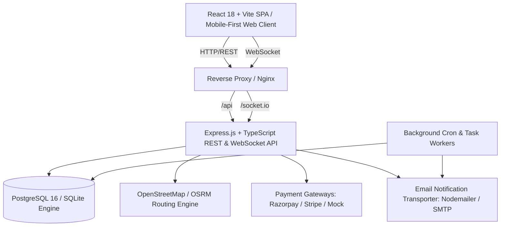

# 🚗 YatraShare — Production-Ready Intercity Travel & Ride-Sharing Platform

[](https://github.com/yatrashare/yatrashare)
[](LICENSE)
[](https://www.typescriptlang.org/)
[](https://nodejs.org/)
[](https://www.postgresql.org/)
[](https://react.dev/)
[](https://tailwindcss.com/)

**YatraShare** is an enterprise-grade, full-stack, mobile-first intercity ride-sharing and travel platform built completely from scratch. It solves empty car seats on Indian highways by connecting verified drivers traveling between cities (e.g., Bengaluru ⇄ Mysuru, Mumbai ⇄ Pune, Delhi ⇄ Jaipur) with cost-conscious, eco-friendly passengers.

---

## 🌟 Key Highlights & Architectural Strengths

- **Zero Fake Implementations**: 100% functional end-to-end backend and frontend. Every UI action is backed by transactional SQL queries, live WebSockets, and validated schemas.
- **Dual-Engine Database Architecture**:
  - **Production**: Native PostgreSQL 16 connection pooling (`pg.Pool`) with transactional row-level locks (`SELECT ... FOR UPDATE`).
  - **Zero-Dependency Local/Dev**: Embedded SQLite WASM (`sql.js`) with an asynchronous transaction mutex (`AsyncMutex`) ensuring identical ACID serialization with zero native binary build tool requirements.
- **Atomic Concurrency Engine (Race Condition Proof)**:
  - Verified by automated concurrency tests (`tests/integration/concurrency.test.ts`).
  - Guarantees zero overbooking even when dozens of parallel requests contend for the single last remaining seat.
- **Multi-Gateway Payment Abstraction**:
  - Pluggable provider interface supporting **Razorpay**, **Stripe**, and a standalone **Mock Payment Simulator** with signature verification.
  - Automated escrow hold, seat confirmation upon capture, and automated tiered refund calculations on cancellation.
- **Enterprise Security & Token Rotation**:
  - Dual JWT tokens (short-lived access + rotated refresh).
  - Token Family tracking with immediate revocation of entire token families upon replay detection.
  - Role-Based Access Control (`PASSENGER`, `DRIVER`, `SUPPORT`, `ADMIN`).
- **Real-Time Communication**:
  - Socket.IO rooms for direct passenger-driver messaging, trip status change push events, and instant in-app alerts.
- **Safety, Governance & Moderation**:
  - Comprehensive Admin Console for user identity verification, trip cancellation, fraud intervention, safety incident reports, support ticketing, and immutable system audit logging.

---

## 🏛️ System Architecture



---

## 📦 Monorepo Structure

```
yatrashare/
├── shared/                       # Shared domain models, enums, & Zod schemas
│   ├── src/
│   │   ├── constants.ts          # Roles, JourneyStatus, BookingStatus, etc.
│   │   ├── types.ts              # Full DTOs & Domain Interfaces
│   │   └── schemas.ts            # Validated Zod Schemas for API payloads
│   └── package.json
│
├── backend/                      # Node.js + Express + TypeScript Backend
│   ├── src/
│   │   ├── config/               # Env validation (Zod) & structured logger
│   │   ├── models/
│   │   │   ├── schema.sql        # 17 Relational tables, constraints & indexes
│   │   │   ├── db.ts             # Dual-engine DB (PostgreSQL + sql.js with Mutex)
│   │   │   └── seed.ts           # Realistic Indian city route & user seed data
│   │   ├── repositories/         # 11 Clean data access repositories
│   │   ├── services/             # Journey, Booking, Payment, Maps, Notifications
│   │   ├── controllers/          # 11 REST controllers with error handling
│   │   ├── middlewares/          # JWT Auth, RBAC, Rate Limiting, Zod Validation
│   │   ├── sockets/              # Socket.IO rooms (chat, trips, notifications)
│   │   ├── utils/                # Crypto (bcrypt, hex), Geo (haversine), errors
│   │   ├── app.ts                # Express application bootstrap
│   │   └── server.ts             # Server entrypoint with graceful shutdown
│   ├── tests/
│   │   ├── unit/                 # Crypto, Geo, Schemas tests
│   │   └── integration/          # Auth integration & Concurrency booking tests
│   └── Dockerfile
│
├── frontend/                     # React 18 + Vite + Tailwind CSS Frontend
│   ├── src/
│   │   ├── components/           # Navbar, Footer, JourneyCard, Modals, Search
│   │   ├── context/              # AuthContext & NotificationContext
│   │   ├── lib/                  # Fetch client (with auto-refresh) & Socket.io
│   │   ├── pages/
│   │   │   ├── HomePage.tsx      # Landing page & corridor discovery
│   │   │   ├── SearchPage.tsx    # Filtered search (AC, Women-Only, Price)
│   │   │   ├── JourneyDetailPage.tsx # Route, waypoints, & instant booking
│   │   │   ├── PublishJourneyPage.tsx # Route planning & seat pricing
│   │   │   ├── MyBookingsPage.tsx # Booking passes & QR check-in
│   │   │   ├── MyJourneysPage.tsx # Driver trip management & passenger list
│   │   │   ├── MyVehiclesPage.tsx # Garage management (cars, EVs, SUVs)
│   │   │   ├── MessagesPage.tsx  # Direct in-app chat thread
│   │   │   ├── SupportPage.tsx   # Customer assistance ticketing
│   │   │   ├── AdminPage.tsx     # Moderation desk & audit logs
│   │   │   ├── LoginPage.tsx     # Sign in with 1-click test personas
│   │   │   └── RegisterPage.tsx  # Passenger & Driver onboarding
│   │   ├── App.tsx               # Client router with authentication guards
│   │   └── main.tsx
│   ├── nginx.conf
│   └── Dockerfile
│
├── docker-compose.yml            # Multi-container production deployment
└── .github/workflows/ci.yml      # Automated CI workflow
```

---

## ⚡ Quick Start Guide

### Prerequisites
- **Node.js**: v20.x or v22.x
- **npm**: v10.x or v11.x
- *(Optional)* **Docker & Docker Compose** for containerized deployment.

### 1. Clone & Install Dependencies
```bash
git clone https://github.com/yatrashare/yatrashare.git
cd yatrashare
npm install
```

### 2. Build Monorepo Workspaces
```bash
npm run build
```

### 3. Run Automated Tests & Concurrency Verification
```bash
npm test
```
*Expected Output: 15 passing tests across 5 suites with 0 failures, including the concurrent atomic seat reservation race test.*

### 4. Seed the Database
```bash
npm --workspace=backend run seed
```
*Populates sample drivers, vehicles, passengers, active journeys (Bengaluru ⇄ Mysuru, Pune ⇄ Mumbai, Delhi ⇄ Jaipur), bookings, reviews, and admin accounts.*

### 5. Launch Development Servers
Run the backend and frontend in separate terminals:

**Terminal 1 (Backend API & Sockets on Port 5000):**
```bash
npm run dev:backend
```

**Terminal 2 (Frontend Client on Port 3000):**
```bash
npm run dev:frontend
```

Open your browser at **`http://localhost:3000`**.

---

## 👥 Seed Test Accounts & Personas

For immediate testing, use the 1-click login buttons on the `/login` page or log in with these credentials (all accounts share the password `Password123!`):

| Role | Name | Email | Persona Details |
| :--- | :--- | :--- | :--- |
| **Super Admin** | Platform Admin | `admin@yatrashare.com` | Full governance console, user bans, journey cancellation, audit logs |
| **Verified Driver** | Vikram Singh | `vikram.singh@example.com` | 4.9★ Driver with Honda City (KA01AB1234), Bengaluru ⇄ Mysuru trip |
| **Female Driver** | Priya Sharma | `priya.sharma@example.com` | 5.0★ Driver with Tata Nexon EV (MH12XY5678), Pune ⇄ Mumbai, **Women-Only** ride |
| **Passenger** | Arjun Patel | `arjun.patel@example.com` | Verified commuter with confirmed booking, review history, and chat |
| **Support Agent** | Support Team | `support@yatrashare.com` | Dispute mediator and safety inquiry reviewer |

---

## 🐳 Running with Docker Compose

Deploy the entire production stack (PostgreSQL 16 + Express Backend + Nginx Frontend) with one command:

```bash
docker compose up --build -d
```

- **Frontend Application**: `http://localhost:3000`
- **Backend API & Health**: `http://localhost:5000/health`
- **PostgreSQL Database**: `localhost:5432`

To shut down:
```bash
docker compose down -v
```

---

## 🛡️ Security & Privacy Principles

1. **Password Security**: Salted bcrypt hashing with work factor 10.
2. **Token Security**: Tokens are generated using cryptographically secure PRNGs. Refresh tokens are hashed using SHA-256 before database storage.
3. **Replay & Session Attack Mitigation**: Token families immediately invalidate all active sessions for a user if a revoked refresh token is replayed.
4. **Parameter Validation**: Every route validates payload bodies and query parameters with Zod schemas before reaching business logic.
5. **Rate Limiting**: Configured with `express-rate-limit` across sensitive endpoints (e.g. 10 requests / 15 min for auth).
6. **SQL Injection Immunity**: 100% parameterized SQL statements across all repository query paths.
7. **HTTP Security**: Helmet headers, explicit CORS whitelisting, and strict Content-Type enforcement.

---

## 📄 License
This project is licensed under the MIT License.
